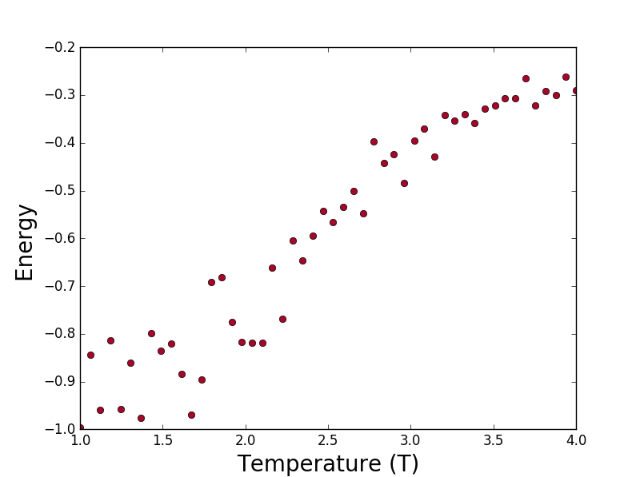

# ising-model

Basic Ising model using monte-carlo in python

# Overview and Aims

Basic implementation of a monte-carlo method to the 2d Ising model. Currently the only result is an energy-temperature graph showing the phase shift around 2.5 T. 

Want to implement more graphs, such as heat capactiy and magnetization to see the phase shift from more angles. Also potentially want to run it as an observable simulation to see the phases form.

## Installation

To run on windows, if git is installed:

        git clone https://github.com/DKarandikar/ising-model.git
        cd ising-model
        pip install .

Otherwise use the github clone function directly and then just pip in the dowload location.

## Testing

From command line in directory run:

        nosetests
or 

        python setup.py test
        
Otherwise, install it and then in python type:

        import ising
        ising.test()

Result should be a matplotlib graph of the form:

## Usage

To use more generally import ising, then use:

        ising_graphs(n_0, n_max, move_n, T_steps, T_range)

Where:

- n_0 is the number of iterations to run to equilibrate 
- n_max is the number of iterations to run per temperate step on top of n_0
- move_n is the number of times to attempt to flip a spin per step
- T_steps is the number of discrete temperate points to run for 
- T_range is a tuple (a,b) where a is the initial temperature and b is the final

Overall, the script should try to flip a spin (n_0 + n_max)* move_n * T_steps times per graph

## Changelog

### [0.1.0] - 25/01/2017

- Migrated to a package format installed with pip or python install
- Minimal changes to main functionality
- Migrated test to a proper nosetests structure
- Setup should have relevant dependencies 

### [0.0.1] - 25/01/2017

- Initial version using a .py file in main directory
- Basic implementation established for only E-T graph